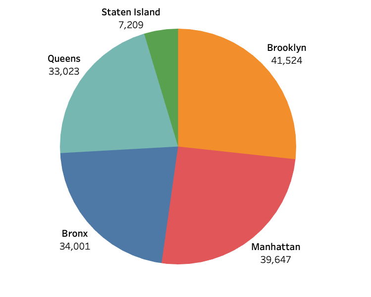
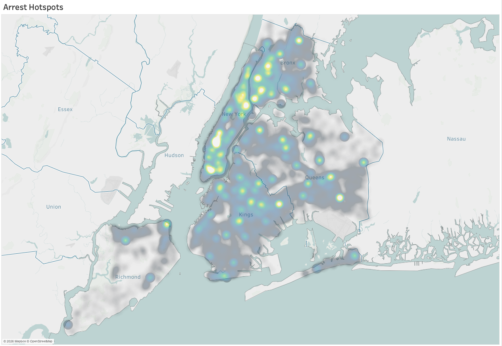
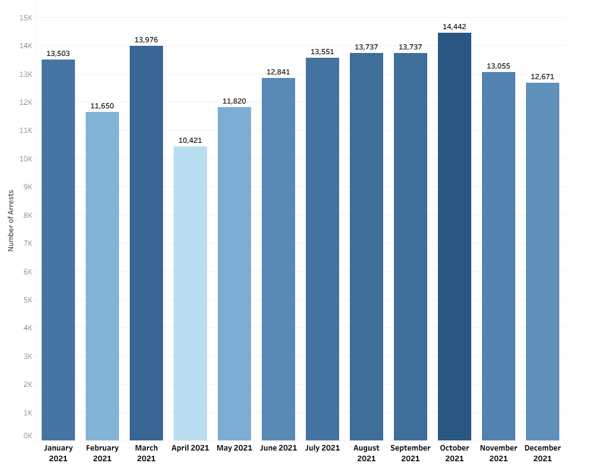
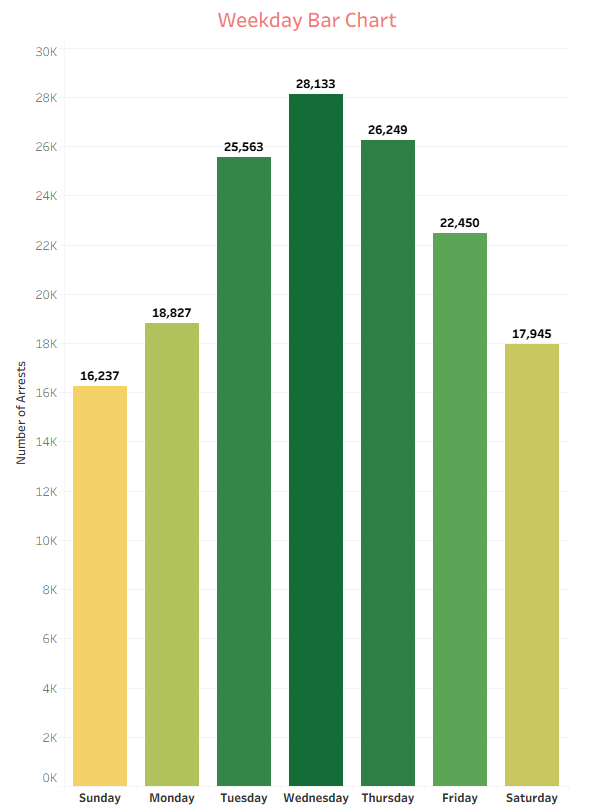
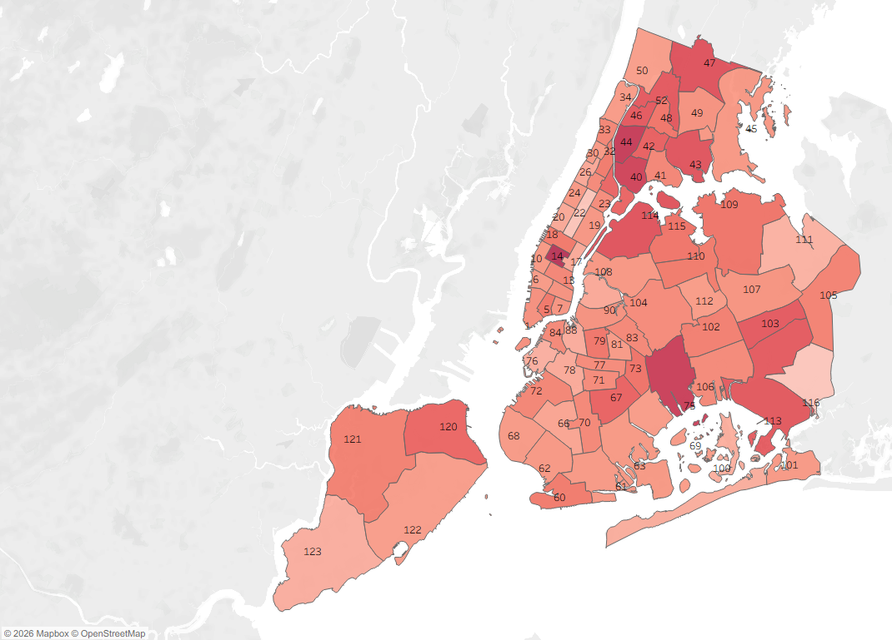
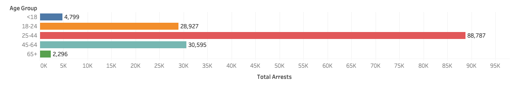
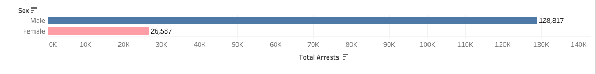
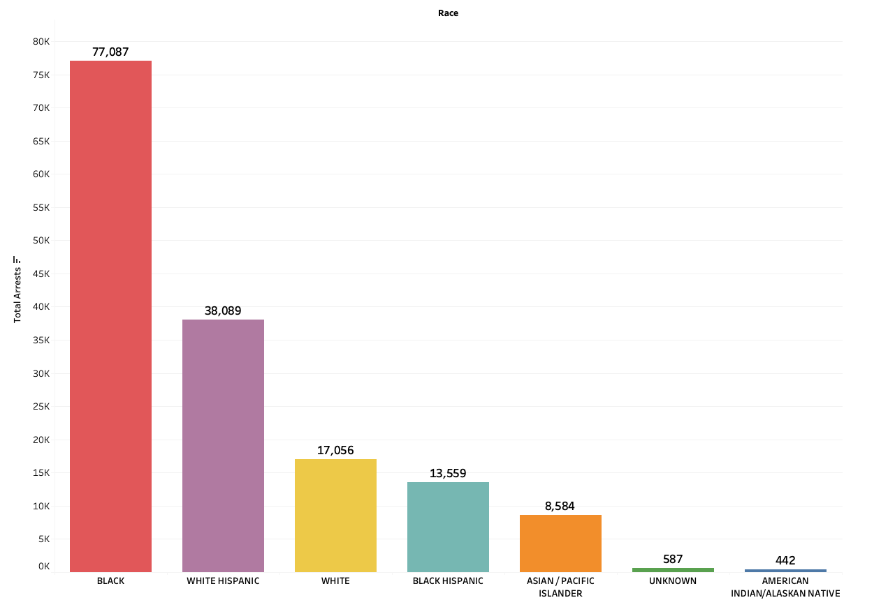
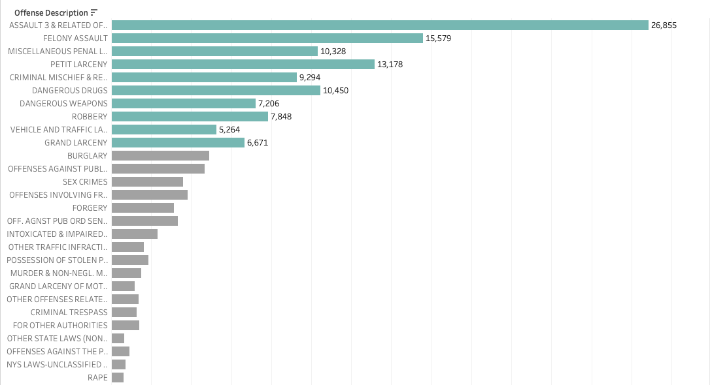

# NYPD Arrest Data Analysis (2021)

## Overview
This project analyzes 155,000+ NYPD arrest records across New York City to identify geographic, demographic, and offense-related patterns. The goal is to uncover insights that can support data-driven public safety decisions, such as where to allocate resources like patrols, streetlights, and emergency infrastructure.

## Business Questions
- Where are arrests most concentrated across NYC?
- Which demographics are most impacted?
- What types of crimes occur most frequently?
- How can this data guide smarter resource allocation?

## Stakeholders
- NYC government officials (Mayor, policy makers)
- Law enforcement agencies
- Local communities and the general public

## Data Cleaning and Preparation
Performed data validation and preprocessing in Excel to ensure data quality and reliability:

- Removed incomplete records missing key classification fields (PD_DESC, OFNS_DESC, KY_CD) where identification was not possible
- Handled missing offense category values (LAW_CAT_CD) by labeling them as "Unknown" to preserve data without introducing bias
- Verified dataset integrity by confirming no duplicate records using ARREST_KEY
- Retained ambiguous administrative columns to avoid unintended data loss

## Analysis Approach
- Conducted exploratory data analysis using Excel
- Built visualizations in Tableau to identify trends across:
  - Boroughs and geographic clusters
  - Demographics (age, gender, race)
  - Offense categories
  - Time-based patterns (monthly and weekday trends)

## Key Visualizations and Insights

### Arrest Distribution by Borough

- Brooklyn (~41.5K), Manhattan (~39.6K), and the Bronx (~34K) have the highest arrest volumes
- Staten Island shows significantly lower activity
- Arrests are concentrated in a few boroughs rather than evenly distributed

### Arrest Hotspots (Geographic Clustering)

- Arrests cluster in specific areas, especially parts of Manhattan and the Bronx
- Suggests targeted interventions are more effective than borough-wide strategies

### Monthly and Weekly Trends

- Arrests peak in October (~14.4K) and are lowest in April (~10.4K)
- Activity is highest mid-week, especially Wednesday (~28.1K)
- Arrests decline on weekends

### Precinct-Level Analysis

- Highest activity precincts: 14, 44, 75
- Lowest activity precincts: 116, 22, 111

### Demographic Analysis

#### Age Distribution

- Ages 25–44 dominate arrests (~88.7K)
- Indicates concentration among working-age adults

#### Gender Distribution

- Male arrests (~128.8K) significantly exceed female arrests (~26.6K)
- Nearly five times higher rate for males

#### Race Distribution

- Black individuals represent the largest group (~77K arrests)
- Hispanic groups combined account for approximately 33%
- Arrest data reflects policing patterns, not actual crime rates

### Offense Analysis

- Most common offenses:
  - Assault-related (~26.9K)
  - Felony assault (~15.6K)
  - Petit larceny (~13.2K)
- A small number of offense types account for a large portion of arrests

## Key Insights
- Arrest activity is concentrated in specific boroughs and hotspots
- Majority of arrests involve individuals aged 25–44 and male individuals
- A limited number of offense types make up a large share of total arrests
- Arrest data reflects enforcement patterns and should be interpreted carefully

## Recommendations
- Focus safety resources such as lighting, patrols, and emergency systems in high-activity areas like Brooklyn, Manhattan and the Bronx.
- Use targeted interventions instead of broad city-wide strategies
- Combine data insights with community context to reduce potential bias
- Prioritize prevention efforts for the most impacted groups

## Limitations
- Arrest data reflects policing activity, not actual crime rates
- Potential bias due to over-policing in certain communities
- Single-year dataset (2021) may not reflect long-term trends

## Tools Used
- Excel (data cleaning and analysis)
- Tableau (data visualization)

## Project Artifacts
- docs/data_cleaning_process.pdf
- docs/one_pager.pdf
- docs/slides.pdf
