# NYPD Arrest Data Analysis (2021)

## Overview

This project analyzes 155,000+ NYPD arrest records from 2021 to identify geographic, demographic, time-based, and offense-related patterns across New York City. The goal is to understand where arrest activity is concentrated, which groups appear most frequently in arrest records, and what offense categories make up the largest share of arrests.

This project was originally developed as a data analysis presentation and later expanded into a polished, interactive Tableau dashboard portfolio project.

**Interactive Tableau Dashboard:**  
https://public.tableau.com/app/profile/jorgeluis.done/viz/2021_NYPD_Arrest_Data_Analysis/ExecutiveOverview#1

## Business Questions

- Where are arrests most concentrated across NYC?
- Which boroughs and precincts show the highest arrest activity?
- Which demographic groups appear most frequently in arrest records?
- What offense categories occur most often?
- How can arrest patterns support better resource planning and public safety decisions?

## Stakeholders

- NYC government officials and policy makers
- Public safety and law enforcement agencies
- Community organizations
- Local residents and the general public
- Data analysts supporting civic or public sector decision-making

## Dataset

The dataset contains NYPD arrest records from 2021, including fields such as arrest date, borough, precinct, age group, sex, race, offense description, law category, and geographic coordinates.

Key dataset details:

- 155,404 arrest records after cleaning
- 5 NYC boroughs
- 77 precincts
- Geographic fields for latitude and longitude
- Offense, demographic, and time-based attributes

## Data Cleaning and Preparation

Data validation and preprocessing were performed in Excel to improve reliability before building the Tableau dashboard.

Cleaning steps included:

- Removed incomplete records missing key classification fields such as `PD_DESC`, `OFNS_DESC`, and `KY_CD`
- Labeled missing `LAW_CAT_CD` values as `Unknown` to preserve usable records without introducing assumptions
- Checked for duplicate records using `ARREST_KEY`
- Standardized borough and category values for clearer dashboard labels
- Verified field types for dates, numeric measures, and geographic coordinates
- Retained relevant administrative fields to avoid unintended data loss

## Analysis Approach

The analysis was organized around three Tableau dashboard pages:

1. **Executive Overview**  
   Summarizes overall arrest activity across boroughs, time periods, offense categories, and high-level demographic patterns.

2. **Geographic Hotspots**  
   Focuses on precinct-level arrest concentration and geographic patterns across NYC.

3. **Demographics & Offenses**  
   Analyzes arrest patterns by age group, sex, race, offense category, and law category.

## Tableau Dashboard

### Executive Overview

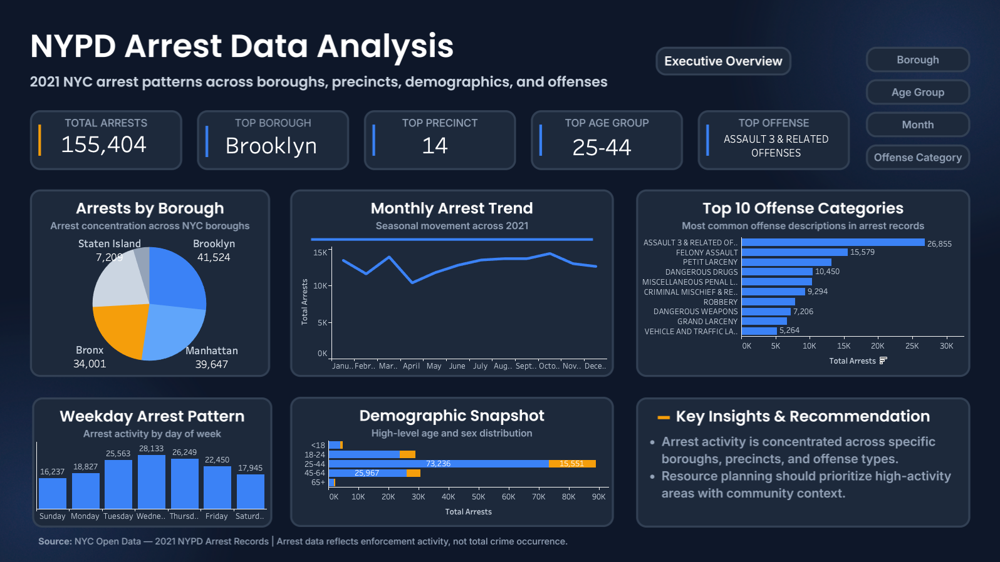

Key insights:

- Brooklyn had the highest arrest volume with 41,524 arrests
- Manhattan and the Bronx also showed high arrest activity
- Arrest activity peaked around October and was lowest around April
- Wednesday had the highest weekday arrest activity
- Assault-related offenses were the most common offense category

### Geographic Hotspots

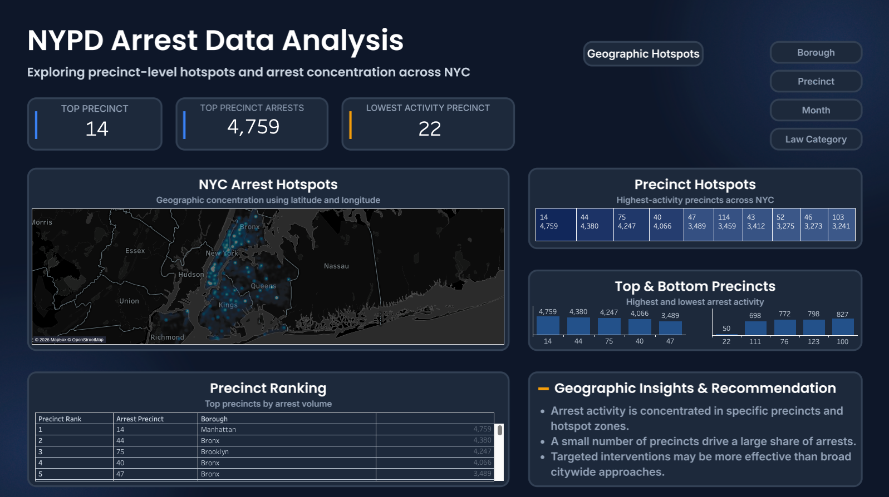

Key insights:

- Arrest activity is concentrated in specific precincts rather than evenly distributed citywide
- Precinct 14 had the highest arrest volume with 4,759 arrests
- Other high-activity precincts included 44, 75, 40, and 47
- Lower-activity precincts showed much smaller arrest counts
- Geographic clustering suggests targeted resource allocation may be more effective than broad citywide strategies

### Demographics & Offenses

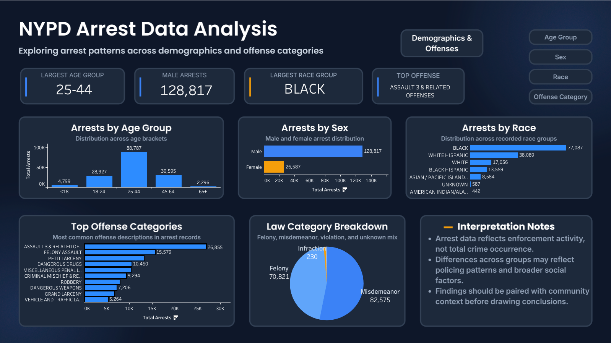

Key insights:

- Ages 25–44 represented the largest age group in arrest records
- Male arrests were significantly higher than female arrests
- Black individuals represented the largest recorded race group in the dataset
- Assault-related offenses were the most common offense type
- Misdemeanor and felony categories made up most arrest records

## Additional Visual Analysis

Earlier versions of this project included individual chart exports and presentation visuals. These are kept in the repository as supporting materials for the original analysis and slide deck.

### Arrest Distribution by Borough

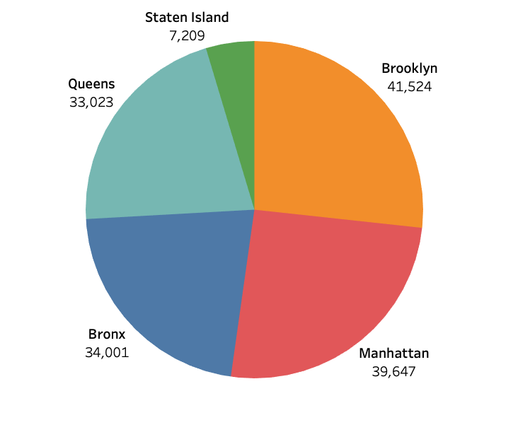

- Brooklyn, Manhattan, and the Bronx had the highest arrest volumes
- Staten Island showed significantly lower activity
- Arrests were concentrated in a few boroughs rather than evenly distributed

### Arrest Hotspots

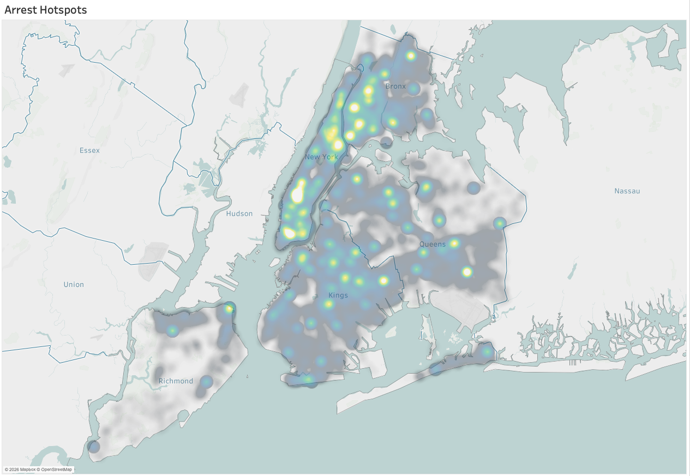

- Arrests clustered in specific areas, especially parts of Manhattan and the Bronx
- Precinct-level patterns suggest targeted interventions may be more effective than borough-wide strategies

### Monthly and Weekly Trends

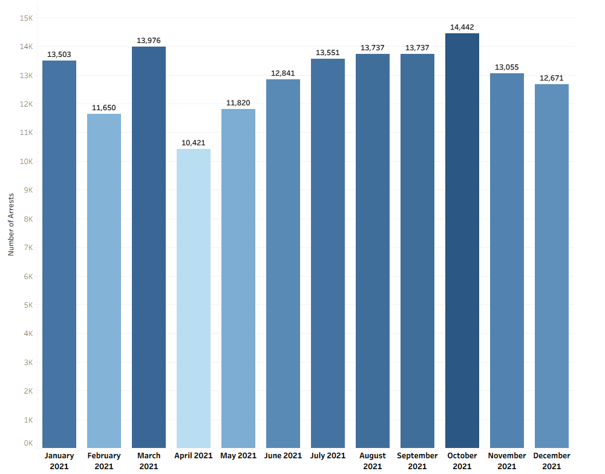

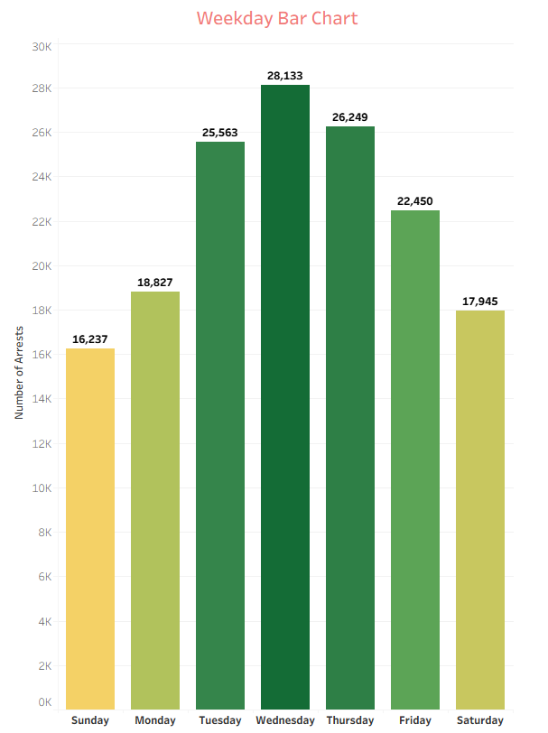

- Arrests peaked in October and were lowest in April
- Activity was highest mid-week, especially Wednesday
- Arrests declined on weekends

### Precinct-Level Analysis

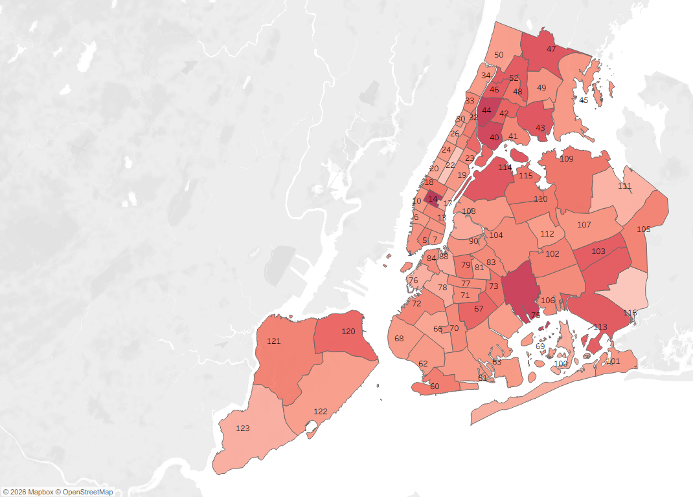

- Highest activity precincts included 14, 44, and 75
- Lower-activity precincts had significantly fewer arrests

### Demographic Analysis

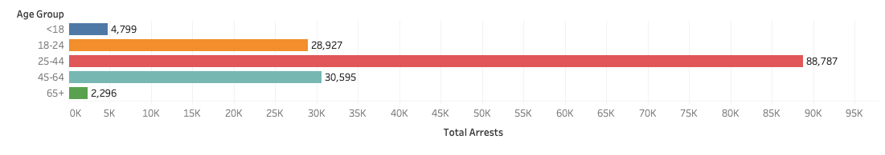

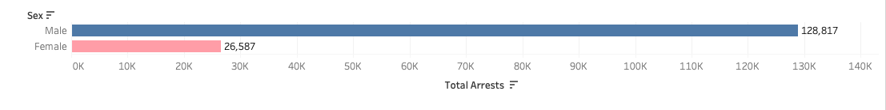

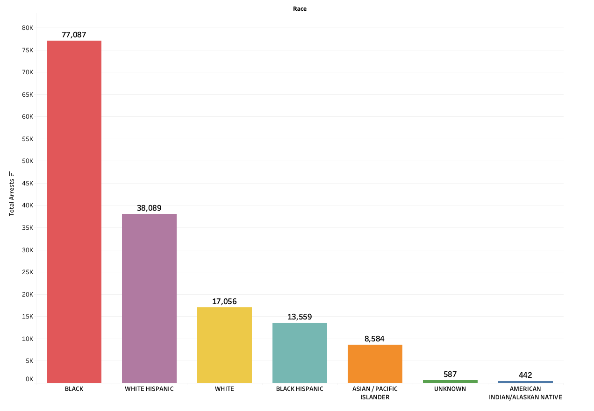

- Ages 25–44 dominated arrest records
- Male arrests significantly exceeded female arrests
- Race-related findings should be interpreted carefully because arrest data reflects enforcement activity, not total crime occurrence

### Offense Analysis

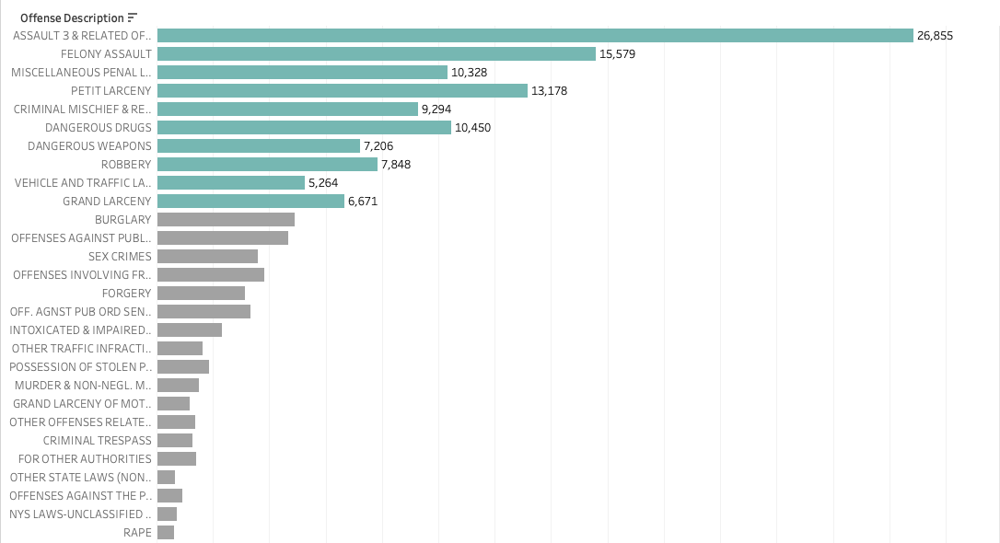

- Assault-related offenses were the most common offense type
- Felony assault and petit larceny were also among the highest-volume offenses
- A small number of offense types accounted for a large share of total arrests

## Key Findings

- Arrest activity is concentrated in specific boroughs, precincts, and hotspot areas
- Brooklyn, Manhattan, and the Bronx showed the highest overall arrest volumes
- Precinct-level analysis revealed that a small number of precincts account for a large share of arrests
- Ages 25–44 and male individuals appeared most frequently in arrest records
- A limited number of offense categories made up a large portion of total arrests
- Arrest data reflects enforcement activity and should not be interpreted as a complete measure of crime occurrence

## Recommendations

- Prioritize public safety resources in high-activity boroughs, precincts, and hotspot zones
- Use precinct-level patterns to support more targeted interventions instead of broad citywide strategies
- Pair arrest data with community context before drawing policy conclusions
- Use demographic findings carefully, since arrest records may reflect enforcement patterns and policing practices
- Combine this analysis with additional data sources such as calls for service, reported crime, population, and socioeconomic indicators

## Limitations

- Arrest data reflects enforcement activity, not total crime occurrence
- Arrest patterns may be influenced by policing practices, reporting behavior, and neighborhood-level enforcement differences
- The analysis only covers 2021, so it may not represent long-term trends
- Demographic patterns should be interpreted carefully and not used to make assumptions about crime rates by group
- Geographic analysis depends on the accuracy and completeness of latitude and longitude fields

## Tools Used

- Excel: data cleaning, validation, and preprocessing
- Tableau: interactive dashboard development and visualization
- GitHub: project documentation and portfolio presentation
